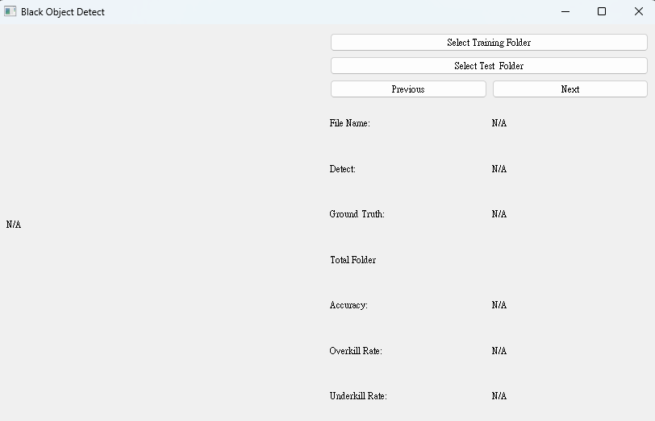
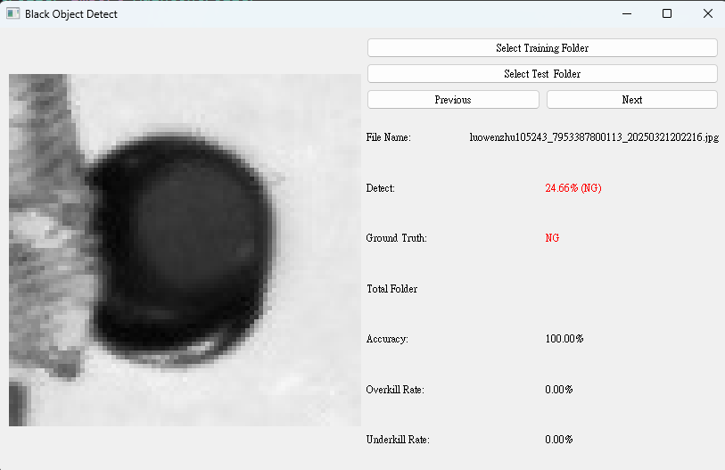

本專案於 Windows 11 系統下執行，主要功能為偵測 PCB 上黑色銅片區域是否遭到遮擋。使用者可透過 Qt 製作的圖形介面操作，程式已打包為可執行應用程式，方便使用。開啟程式後，請先選擇訓練資料資料夾，以建立正常銅片的面積閥值，接著再選擇欲偵測的測試資料夾，即可開始進行遮擋偵測。

# 🧪 PCB Black Copper Area Occlusion Detection

This project is designed to detect whether the **black copper areas** on a **PCB (Printed Circuit Board)** are occluded. It runs on **Windows 11**, features a **Qt-based graphical user interface**, and is packaged as a **standalone executable** for convenient use.

---

## 🖥️ Features

- Detect occlusion of black copper regions on PCB images
- GUI built with **Qt**
- Easy-to-use interface with step-by-step flow
- Automatically computes threshold from training images
- Supports batch testing of image folders
- Packaged as a single executable for easy deployment

---

## 📂 How to Use

1. **Launch the application** (on Windows 11).
2. **Select the training folder**  
   Provide a folder of normal PCB images to compute the area threshold of the black copper regions.
3. **Select the test folder**  
   Choose the folder containing test images. The system will automatically detect occlusions based on the learned threshold.
4. **View results** directly in the interface.

---

## 📷 Interface Preview

**Initial Window**



**Detection Demo**



---

## 🛠️ System Requirements

- OS: **Windows 11**
- Python ≥ 3.8 (if running from source)
- Qt 5 (for GUI development)
- OpenCV, NumPy (for image processing)

---

## 🚀 Run Instructions

### Option 1: Run Executable (Recommended)

Download and run the packaged `.exe` file — no setup required.

### Option 2: Run from Source

```bash
git clone https://github.com/yahmax274/Black-object-detect.git
pip install -r requirements.txt
python main.py
